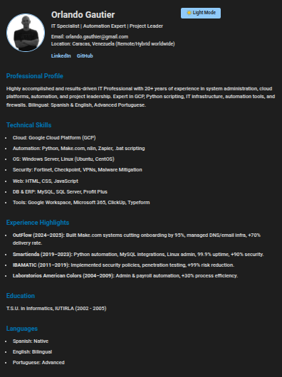

# 🌐 Profile HTML + CSS

A responsive personal profile page built with HTML, CSS, and JavaScript.
Perfect as a starting point to showcase personal information, skills, experience, and contact links in a clean, professional layout.

## 📸 Preview

 <!-- You can upload a screenshot of your site and rename it like this -->

🧠 About
This project represents a static personal profile page including:

📷 Profile picture and contact information

💼 Brief professional bio and experience

🛠️ Technical skills

🎓 Education and language proficiency

🔗 Social media links (LinkedIn, GitHub)

🌙 Dark Mode toggle with theme persistence using JavaScript

Fully responsive and mobile-friendly using HTML5, CSS3, and JavaScript.

🆕 Latest Update
Added Dark Mode feature with a toggle button

Separated JavaScript into an external main.js file

Improved user experience and accessibility

Tested functionality on major browsers (Chrome, Firefox)

## 🚀 Live Demo

🔗 [View the live site on GitHub Pages](https://orlandogautier.github.io/profile-html-css/)  
> *(Replace `yourusername` with your GitHub username)*

## 🛠️ Technologies Used

- HTML5  
- CSS3 (with media queries for responsiveness)
- JavaScript (for Dark Mode toggle and theme persistence)
- Google Fonts (Roboto)  
- GitHub Pages for deployment

## 📁 Folder Structure
/ (root folder)
│
├── index.html       # Main HTML file for the profile page
├── styles.css       # CSS styles for layout and responsiveness
├── script.js        # JavaScript file handling Dark Mode toggle
├── screenshot.png   # Screenshot image showing the page preview
└── README.md        # Project documentation and description

